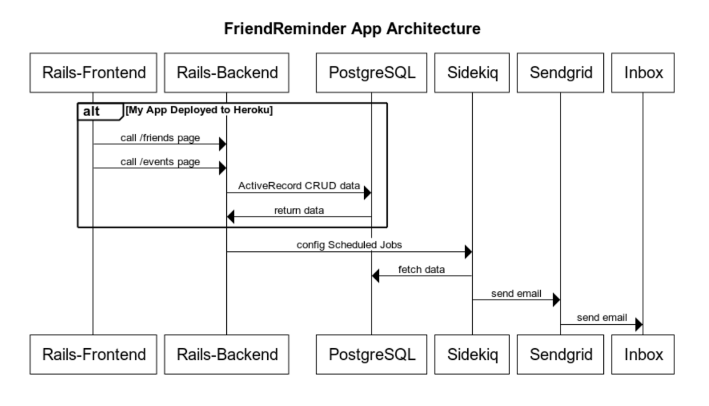

# Friend Reminder

This rails app helps you keep track of your friends and what events you attended together. 

In the future: It will send you email reminders for friends you have not spent time with in awhile.

## Currently Planned Architecture

# Setup
### First Time Setup
## Local Environment
1. Clone down this repo: `git clone [repo_name]`
1. Go into the repo directory: `cd [repo_name]`
1. Install dependencies: `bundle install`

## Local Docker Environment
1. Install [Docker Desktop for Mac](https://hub.docker.com/editions/community/docker-ce-desktop-mac)
1. Go into the repo directory: `cd [repo_name]`
1. Build Docker Image from Dockerfile: `docker build .`
1. Build and run Docker Container Image from Docker Image `docker container run`
Rails server will auto start. 

# Start Server
## Local Server
1. `rails server`

## Local Docker Server
1. Build and run Docker Container Image from Docker Image `docker container run`
rails server auto starts when running the docker container.

# Go to Front End
* Go to Friends page `http://localhost:3000/friends`
* Go to Events page `http://localhost:3000/events`